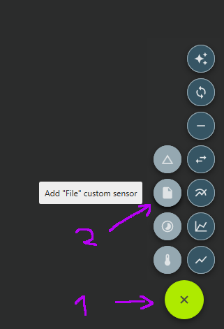
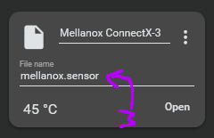

# Mellanox Temperature Query for [Fan Control](https://github.com/Rem0o/FanControl.Releases)
Utilizes custom file sensor to get Mellanox ConnectX temperature inside FanControl.  
Uses `mget_temp` to query temperature.  

## Example
This program needs to run with administrator privileges!  
Otherwise, mget_temp cannot query the temperature.  
`mellanox-temp.exe --exec-path "C:\Program Files\Mellanox\WinMFT\mget_temp.bat" --device mt4103_pci_cr0 --output-path "C:\Users\Admin\AppData\Local\Temp\mellanox.sensor"`

**Available Options:**  
`-d`, `--device` Device path  
`-e`, `--exec-path` Path to executable mget_temp  
`-o`, `--out-path` Output path for sensor temp  
`-i`, `--interval` Interval to update temperature  

**Use in FanControl**  
1. Click the + button in the bottom right corner to create a new file sensor.  
  
2. Click on the empty space (with the placeholder File name) to select the file path.  

3. (Optional) Name your sensor

## Building
`cargo build --release`
The .exe will appear in `target/release/mellanox-temp.exe`
